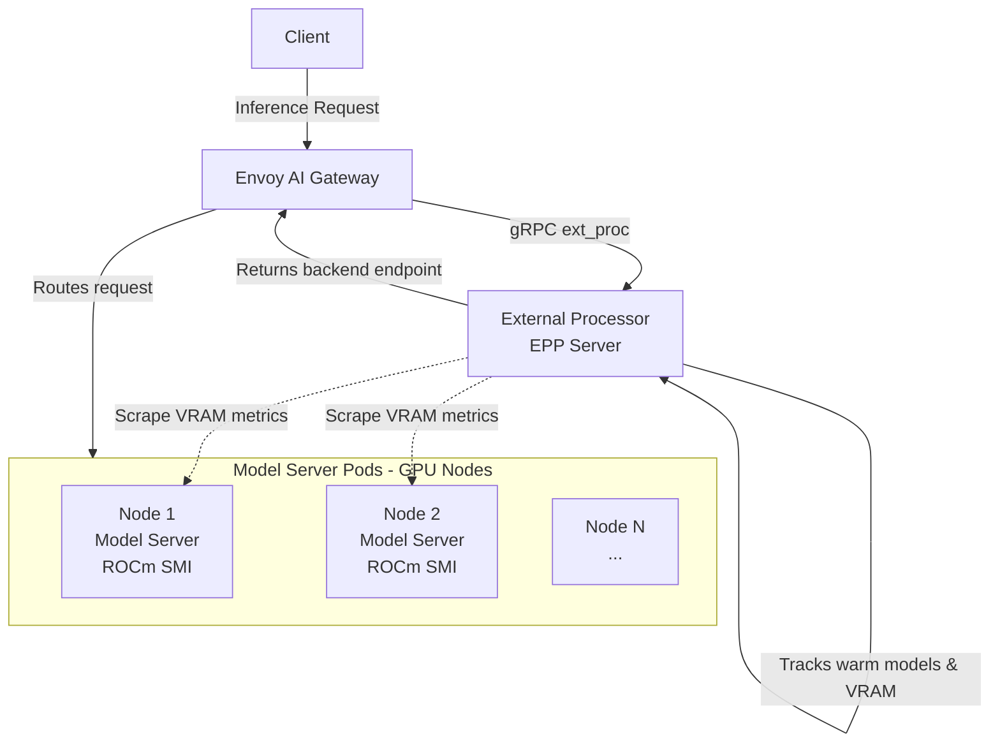
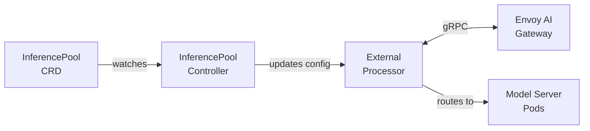

# ROCm Envoy AI Gateway External Processor

An External Processor for Envoy AI Gateway that provides VRAM-aware routing for GPU-based model inference workloads, integrating with the Kubernetes Gateway API Inference Extension.

## Overview

This External Processor enables intelligent routing of AI inference requests to GPU nodes based on available VRAM capacity. It integrates with Envoy AI Gateway via the Gateway API Inference Extension, watching InferencePool resources to automatically configure routing policies.

**Key Features:**
- **InferencePool Integration**: Automatically configures based on Gateway API Inference Extension resources
- **VRAM-Aware Routing**: Routes model loads to nodes with most available GPU memory
- **Persistent Model Servers**: Works with any model server supporting `/v1/models/load` endpoint
- **Dynamic Configuration**: Updates routing based on InferencePool CRD changes
- **OpenTelemetry Metrics**: Built-in observability with Prometheus export

## Architecture

### Components

1. **InferencePool Controller**: Watches InferencePool CRDs and configures the external processor dynamically
2. **External Processor (EPP Server)**: gRPC service implementing Envoy ext_proc protocol for request routing
3. **VRAM Tracker**: Scrapes ROCm SMI exporters on GPU nodes to track memory availability
4. **Router**: Selects optimal backend pods based on VRAM availability and InferencePool configuration

### Request Flow



### InferencePool Controller Flow



### Key Features

- **Persistent Models**: Models stay loaded on GPU nodes, eliminating cold start delays
- **VRAM-Aware Scheduling**: Routes new model loads to nodes with most available VRAM
- **Automatic Discovery**: Continuously tracks warm models across all nodes
- **Gateway API Integration**: Implements Envoy External Processor Protocol for Gateway API Inference Extension
- **High Availability**: Multiple replicas for redundancy

## Installation

### Prerequisites

- Kubernetes cluster (v1.27+)
- GPU nodes with ROCm support
- Envoy AI Gateway deployed
- kubectl configured to access the cluster

### Deploy Model Server DaemonSet

Deploy your model server DaemonSet which will run on all GPU nodes. The model server must support:
- `/v1/models` - List loaded models
- `/v1/models/load` - Load a new model

```bash
kubectl apply -f deployments/daemonset/model-server-daemonset.yaml
```

### Deploy External Processor

```bash
# Build and push the docker image
make docker-build
make docker-push

# Deploy to Kubernetes
kubectl apply -f deployments/extproc/extproc.yaml
```

This creates:
- ServiceAccount with RBAC permissions for InferencePool watching
- Deployment with 2 replicas
- Services for gRPC and metrics

### Create InferencePool Resource

Create an InferencePool to configure the external processor:

```yaml
apiVersion: inference.networking.k8s.io/v1
kind: InferencePool
metadata:
  name: llm-pool
  namespace: llm
spec:
  selector:
    matchLabels:
      app: model-server
  targetPorts:
    - number: 8080
  endpointPickerRef:
    name: external-processor
    kind: Service
    port: 9001
```

Apply it:

```bash
kubectl apply -f examples/inferencepool.yaml
```

The external processor will automatically detect the InferencePool and configure itself to route requests to pods matching the selector.

For more details, see [InferencePool Integration Guide](docs/INFERENCEPOOL.md).

## Usage (Static Configuration)

If not using InferencePool CRDs, configure via flags or environment variables:

```bash
# Via command-line flags
./external-processor \
  --namespace=llm \
  --exporter-namespace=kube-system \
  --exporter-pod-selector=app=amd-gpu-metrics-exporter-amdgpu-metrics-exporter \
  --scrape-interval=30s \
  --model-load-endpoint=/v1/models/load

# Via environment variables (EXTPROC_ prefix)
export EXTPROC_NAMESPACE=llm
export EXTPROC_SMI_EXPORTER_PORT=9400
export EXTPROC_SCRAPE_INTERVAL=30s
export EXTPROC_MODEL_LOAD_ENDPOINT=/v1/models/load
./external-processor
```

### Integration with Envoy AI Gateway

The external processor implements the Envoy External Processor Protocol and integrates with Envoy AI Gateway via Gateway API Inference Extension.

#### Example InferencePool Configuration

```yaml
apiVersion: inference.networking.k8s.io/v1
kind: InferencePool
metadata:
  name: llm-pool
  namespace: llm
spec:
  targetPorts:
    - number: 8080
  selector:
    app: model-server
  extensionRef:
    name: external-processor
    kind: Service
    port: 9001
```

#### Example HTTPRoute Configuration

```yaml
apiVersion: gateway.networking.k8s.io/v1
kind: HTTPRoute
metadata:
  name: inference-route
  namespace: llm
spec:
  parentRefs:
    - group: gateway.networking.k8s.io
      kind: Gateway
      name: inference-gateway
  rules:
    - matches:
        - path:
            type: PathPrefix
            value: /v1/
      backendRefs:
        - group: inference.networking.k8s.io
          kind: InferencePool
          name: llm-pool
```

The external processor receives requests from Envoy via gRPC, extracts the model name, selects the optimal backend pod based on VRAM availability, and returns the endpoint to Envoy for routing.

### Monitoring

Prometheus metrics are available at:

```bash
# External processor metrics (aggregated VRAM metrics)
curl http://external-processor.llm:9090/metrics

# Health check
curl http://external-processor.llm:9090/healthz

# Readiness check
curl http://external-processor.llm:9090/readyz
```

### Configuration

The external processor can be configured via command-line flags, environment variables (EXTPROC_ prefix), or YAML config file:

- `--grpc-port`: gRPC server port for Envoy ext_proc (default: 9001)
- `--metrics-port`: Metrics and health check server port (default: 9090)
- `--namespace`: Namespace to watch for model server pods (default: llm)
- `--exporter-namespace`: Kubernetes namespace containing GPU metrics exporter pods (default: kube-system)
- `--exporter-pod-selector`: Label selector to find GPU metrics exporter pods as key=value pairs (default: app=amd-gpu-metrics-exporter-amdgpu-metrics-exporter)
- `--scrape-interval`: VRAM metrics scrape interval (default: 30s)
- `--model-load-endpoint`: Model load API endpoint (default: /v1/models/load)
- `--enable-inference-pool`: Enable InferencePool controller (default: true)

## Development

### Build

```bash
# Build binary
make build

# Run tests
make test

# Run locally (requires kubeconfig)
make run
```

### Testing

The project includes unit tests for all major components:

```bash
go test -v ./...
```
