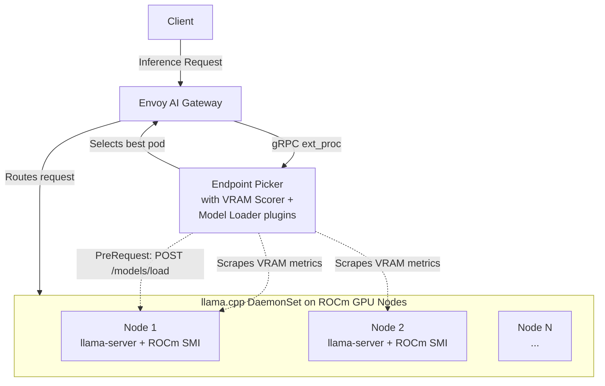

# ROCm llama.cpp Envoy AI Gateway External Processor

A custom endpoint picker for [Gateway API Inference Extension](https://gateway-api-inference-extension.sigs.k8s.io/) that adds VRAM-aware scoring and on-demand model loading for llama.cpp model servers running on AMD ROCm GPUs.

## What It Does

This project extends the official Gateway API Inference Extension endpoint picker (EPP) with two custom plugins:

- **VRAM Scorer** -- scores backend pods by available GPU memory so that the scheduler prefers nodes with the most free VRAM.
- **Model Loader** -- a PreRequest plugin that ensures the requested model is loaded on the target llama.cpp instance before the request is forwarded.

It runs as a drop-in replacement for the standard EPP, using the official `gateway-api-inference-extension` framework with custom plugin registration. The custom plugins work alongside the built-in scorers (queue-scorer, kv-cache-utilization-scorer).

## Architecture



### How It Works

1. A client sends an inference request (e.g. `/v1/chat/completions`) to an Envoy AI Gateway.
2. Envoy calls this external processor via gRPC.
3. The EPP scheduler scores pods using the built-in queue and KV cache scorers alongside the custom **VRAM Scorer**, which queries ROCm SMI exporters to rank pods by available GPU memory.
4. The scheduler picks the best pod based on weighted scores.
5. The **Model Loader** PreRequest plugin checks whether the target model is loaded on the chosen llama.cpp instance. If not, it calls `POST /models/load` to load it before the request is forwarded.
6. Envoy routes the request to the selected pod.

### Components

| Package | Purpose |
|---------|---------|
| `cmd/epp` | Entry point -- starts the VRAM tracker, registers plugins, runs the EPP framework |
| `internal/plugins/scorer` | VRAM scorer plugin (implements `framework.Scorer`) |
| `internal/plugins/modelloader` | Model loader PreRequest plugin (implements `requestcontrol.PreRequest`) |
| `internal/vram` | VRAM tracker -- discovers ROCm SMI exporter pods, scrapes Prometheus metrics, tracks per-node GPU memory |
| `internal/router` | Model routing with warm model discovery, on-demand loading, and Kubernetes Lease-based coordination |
| `internal/pool` | Multi-pool manager for InferencePool resources |
| `internal/controller` | InferencePool CRD controller |
| `internal/telemetry` | OpenTelemetry metrics and tracing setup |
| `internal/version` | Build-time version information |

## Prerequisites

- Kubernetes cluster (v1.27+)
- AMD GPU nodes with ROCm and [AMD GPU Metrics Exporter](https://github.com/amd/amd-gpu-metrics-exporter) deployed
- llama.cpp (`llama-server`) running on GPU nodes
- [Envoy AI Gateway](https://aigateway.envoyproxy.io/) with Gateway API Inference Extension CRDs installed

## Example Deployment

The examples below reflect a real deployment with llama.cpp serving Qwen3 and Nemotron models on AMD Strix Halo GPUs.

### Gateway

```yaml
apiVersion: gateway.networking.k8s.io/v1
kind: Gateway
metadata:
  name: llm-inference-gateway
  namespace: llm
spec:
  gatewayClassName: envoy-gateway-class
  infrastructure:
    parametersRef:
      group: gateway.envoyproxy.io
      kind: EnvoyProxy
      name: llm-inference-envoy-proxy
  listeners:
    - name: http
      port: 80
      protocol: HTTP
```

### llama.cpp DaemonSet

The model server runs as a DaemonSet on all nodes with AMD GPUs. Models are stored as OCI image volumes and mounted into the container.

```yaml
apiVersion: apps/v1
kind: DaemonSet
metadata:
  name: llamacpp-model-server
  namespace: llm
spec:
  selector:
    matchLabels:
      app: llamacpp-model-server
  template:
    metadata:
      labels:
        app: llamacpp-model-server
    spec:
      hostIPC: true
      hostNetwork: true
      nodeSelector:
        amd.com/gpu.device-id: "1586"  # AMD Strix Halo
      tolerations:
        - key: amd.com/gpu
          operator: Exists
          effect: NoSchedule
      securityContext:
        supplementalGroups: [39, 105]
      containers:
        - name: llamacpp
          image: docker.io/kyuz0/amd-strix-halo-toolboxes:rocm-7.2
          command: [llama-server]
          args:
            - --models-preset
            - /config/config.ini
            - --models-max
            - "1"
            - --host
            - 0.0.0.0
            - --port
            - "8080"
          ports:
            - name: http
              containerPort: 8080
          resources:
            requests:
              cpu: "4"
              memory: 32Gi
            limits:
              amd.com/gpu: "1"
              memory: 48Gi
          volumeMounts:
            - name: config
              mountPath: /config
              readOnly: true
            - name: models-qwen3-coder
              mountPath: /models/qwen3-coder
            - name: shm
              mountPath: /dev/shm
      volumes:
        - name: config
          configMap:
            name: llamacpp-models-config
        - name: models-qwen3-coder
          image:
            reference: ghcr.io/randomvariable/models/qwen3-coder-30b-a3b:Q4_K_M
            pullPolicy: Always
        - name: shm
          emptyDir:
            medium: Memory
            sizeLimit: 8Gi
```

### InferencePool

```yaml
apiVersion: inference.networking.k8s.io/v1
kind: InferencePool
metadata:
  name: llm-pool
  namespace: llm
spec:
  selector:
    matchLabels:
      app: llamacpp-model-server
  targetPorts:
    - number: 8080
  endpointPickerRef:
    name: external-processor
    port:
      number: 9001
```

### AIGatewayRoute

Envoy AI Gateway uses `AIGatewayRoute` resources to map model names to backend InferencePools. Each rule matches on the `x-ai-eg-model` header (set by the AI Gateway from the request body's `model` field). A catch-all rule at the end routes any unmatched model to the same pool.

```yaml
apiVersion: aigateway.envoyproxy.io/v1alpha1
kind: AIGatewayRoute
metadata:
  name: llm-inference
  namespace: llm
spec:
  parentRefs:
    - group: gateway.networking.k8s.io
      kind: Gateway
      name: llm-inference-gateway
  rules:
    - matches:
        - headers:
            - name: x-ai-eg-model
              type: Exact
              value: qwen3-coder
        - headers:
            - name: x-ai-eg-model
              type: Exact
              value: Qwen3-Coder-30B-A3B-Instruct
      backendRefs:
        - group: inference.networking.k8s.io
          kind: InferencePool
          name: llm-pool
    - matches:
        - headers:
            - name: x-ai-eg-model
              type: Exact
              value: nemotron-3-nano
        - headers:
            - name: x-ai-eg-model
              type: Exact
              value: Nemotron-3-Nano-30B-A3B
      backendRefs:
        - group: inference.networking.k8s.io
          kind: InferencePool
          name: llm-pool
    # Catch-all rule for any model
    - backendRefs:
        - group: inference.networking.k8s.io
          kind: InferencePool
          name: llm-pool
```

### External Processor Deployment

```yaml
apiVersion: apps/v1
kind: Deployment
metadata:
  name: external-processor
  namespace: llm
spec:
  replicas: 2
  selector:
    matchLabels:
      app: external-processor
  template:
    metadata:
      labels:
        app: external-processor
    spec:
      serviceAccountName: external-processor
      containers:
        - name: external-processor
          image: ghcr.io/randomvariable/rocm-llamacpp-envoy-ai-gateway-external-processor:latest
          args:
            - --pool-name=llm-pool
            - --pool-namespace=llm
            - --grpc-port=9001
            - --metrics-port=9090
            - --secure-serving
            - --cert-path=/etc/extproc/tls
            - --config-file=/etc/epp/epp-config.yaml
          env:
            - name: POD_NAMESPACE
              valueFrom:
                fieldRef:
                  fieldPath: metadata.namespace
            - name: EXTPROC_NAMESPACE
              value: llm
            - name: EXTPROC_EXPORTER_NAMESPACE
              value: kube-system
            - name: EXTPROC_SCRAPE_INTERVAL
              value: "30s"
          ports:
            - name: grpc
              containerPort: 9001
            - name: metrics
              containerPort: 9090
          resources:
            requests:
              cpu: 100m
              memory: 256Mi
            limits:
              cpu: 500m
              memory: 512Mi
          volumeMounts:
            - name: tls-certs
              mountPath: /etc/extproc/tls
              readOnly: true
            - name: epp-config
              mountPath: /etc/epp
              readOnly: true
      volumes:
        - name: tls-certs
          secret:
            secretName: external-processor-tls
        - name: epp-config
          configMap:
            name: external-processor-config
```

### EPP Plugin Configuration

The `EndpointPickerConfig` configures which scoring plugins are active and their relative weights. The custom `vram-scorer` and `model-loader` plugins are registered alongside the built-in scorers.

```yaml
apiVersion: v1
kind: ConfigMap
metadata:
  name: external-processor-config
  namespace: llm
data:
  epp-config.yaml: |
    apiVersion: inference.networking.x-k8s.io/v1alpha1
    kind: EndpointPickerConfig
    plugins:
      - type: queue-scorer
      - type: kv-cache-utilization-scorer
      - type: vram-scorer
        parameters:
          thresholdGB: 4
      - type: model-loader
        parameters:
          modelServerPort: 8080
          modelLoadEndpoint: "/models/load"
          modelLoadTimeoutSeconds: 600
    schedulingProfiles:
      - name: default
        plugins:
          - pluginRef: queue-scorer
            weight: 2
          - pluginRef: kv-cache-utilization-scorer
            weight: 2
          - pluginRef: vram-scorer
            weight: 3
```

## Configuration

Configuration is via command-line flags or environment variables (`EXTPROC_` prefix):

| Flag | Env Var | Default | Description |
|------|---------|---------|-------------|
| `--namespace` | `EXTPROC_NAMESPACE` | `llm` | Namespace to watch for model server pods |
| `--exporter-namespace` | `EXTPROC_EXPORTER_NAMESPACE` | `kube-system` | Namespace containing ROCm SMI exporter pods |
| `--exporter-pod-selector` | `EXTPROC_EXPORTER_POD_SELECTOR` | `app=amd-gpu-metrics-exporter-...` | Label selector for GPU metrics exporter pods |
| `--scrape-interval` | `EXTPROC_SCRAPE_INTERVAL` | `30s` | VRAM metrics scrape interval |

The EPP framework's own flags (`--pool-name`, `--pool-namespace`, `--grpc-port`, `--metrics-port`, `--secure-serving`, `--cert-path`, `--config-file`) are also available.

## Monitoring

```bash
# Prometheus metrics (includes VRAM and GenAI semantic conventions)
curl http://external-processor.llm:9090/metrics

# Health / readiness (gRPC)
grpcurl -plaintext external-processor.llm:9003 grpc.health.v1.Health/Check
```

## Development

```bash
# Build
make build

# Quick dev build (no version injection)
make build-dev

# Run tests
make test

# Run tests with coverage
make test-coverage

# Lint
make lint

# Build and push to Harbor
make harbor

# Run locally (requires KUBECONFIG)
make run
```

## License

Apache License 2.0. See [LICENSE](LICENSE) for details.
