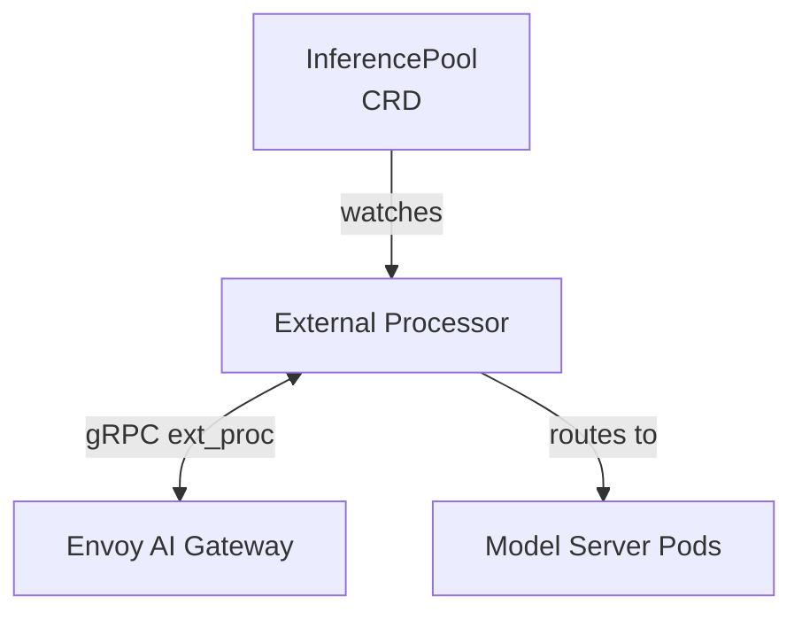
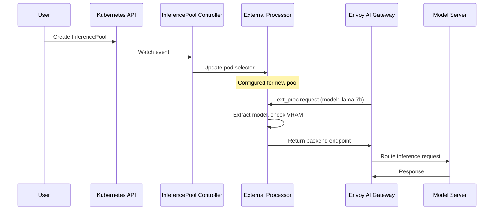
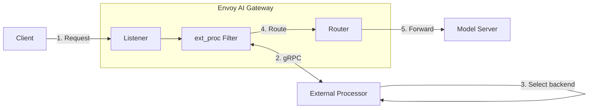
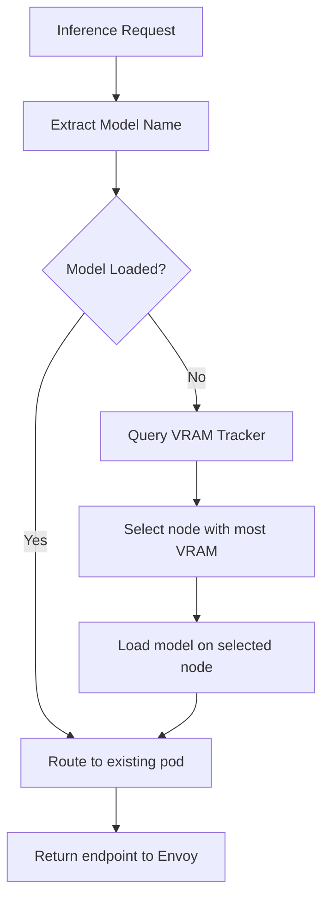

# InferencePool Integration

This external processor implements the Gateway API Inference Extension and integrates with Envoy AI Gateway via InferencePool resources.

## Overview

The external processor watches `InferencePool` CRDs and automatically configures itself based on the pool specification. This eliminates the need for manual configuration when using Envoy AI Gateway.

## Architecture



## Example InferencePool

```yaml
apiVersion: inference.networking.k8s.io/v1
kind: InferencePool
metadata:
  name: llm-pool
  namespace: llm
spec:
  selector:
    matchLabels:
      app: model-server
      model-class: llm
  targetPorts:
    - number: 8080
      name: http
  endpointPickerRef:
    name: external-processor
    kind: Service
    port: 9001
```

## How It Works



1. **InferencePool Creation**: You create an InferencePool resource in Kubernetes
2. **Controller Detection**: The external processor's controller detects the new resource
3. **Configuration Update**: The processor updates its pod selector based on `spec.selector.matchLabels`
4. **Dynamic Routing**: The processor starts routing inference requests to pods matching the selector
5. **VRAM-Aware Selection**: Among matching pods, the processor selects the one on the node with most available VRAM

## Integration with Envoy

The external processor integrates with Envoy AI Gateway as an External Processor:



1. Envoy receives an inference request
2. Envoy calls the external processor via gRPC (ext_proc protocol)
3. The processor extracts the model name from the request
4. The processor selects the optimal backend pod based on VRAM availability
5. The processor returns the backend endpoint to Envoy
6. Envoy routes the request to the selected pod

## Configuration

### Enable/Disable InferencePool Controller

The InferencePool controller is enabled by default. To disable it:

```bash
external-processor --enable-inference-pool=false
```

When disabled, the processor uses static configuration from flags or config file.

### Fallback to Static Configuration

If no InferencePool resources are found, the processor uses the static configuration:

```yaml
# config/external-processor.yaml
namespace: llm
pod-selector:
  app: model-server
node-selector:
  kubernetes.io/gpu: "true"
```

## HTTPRoute Configuration

To route traffic through the InferencePool:

```yaml
apiVersion: gateway.networking.k8s.io/v1
kind: HTTPRoute
metadata:
  name: inference-route
  namespace: llm
spec:
  parentRefs:
    - group: gateway.networking.k8s.io
      kind: Gateway
      name: inference-gateway
  rules:
    - matches:
        - path:
            type: PathPrefix
            value: /v1/
      backendRefs:
        - group: inference.networking.k8s.io
          kind: InferencePool
          name: llm-pool
```

## VRAM-Aware Routing

The external processor implements VRAM-aware routing to optimize GPU memory utilization:



The VRAM Tracker continuously scrapes ROCm SMI exporters on GPU nodes to maintain an up-to-date view of available GPU memory across the cluster.
